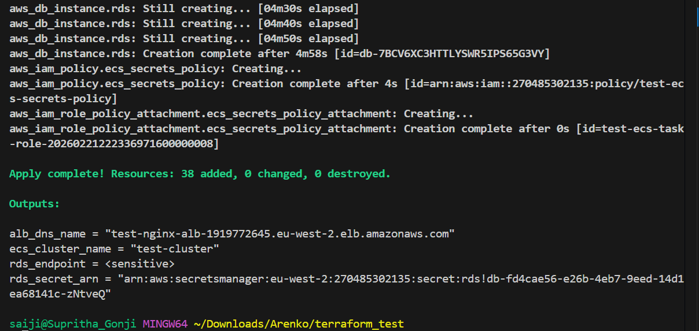
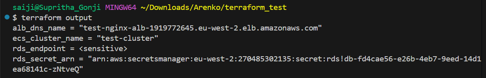
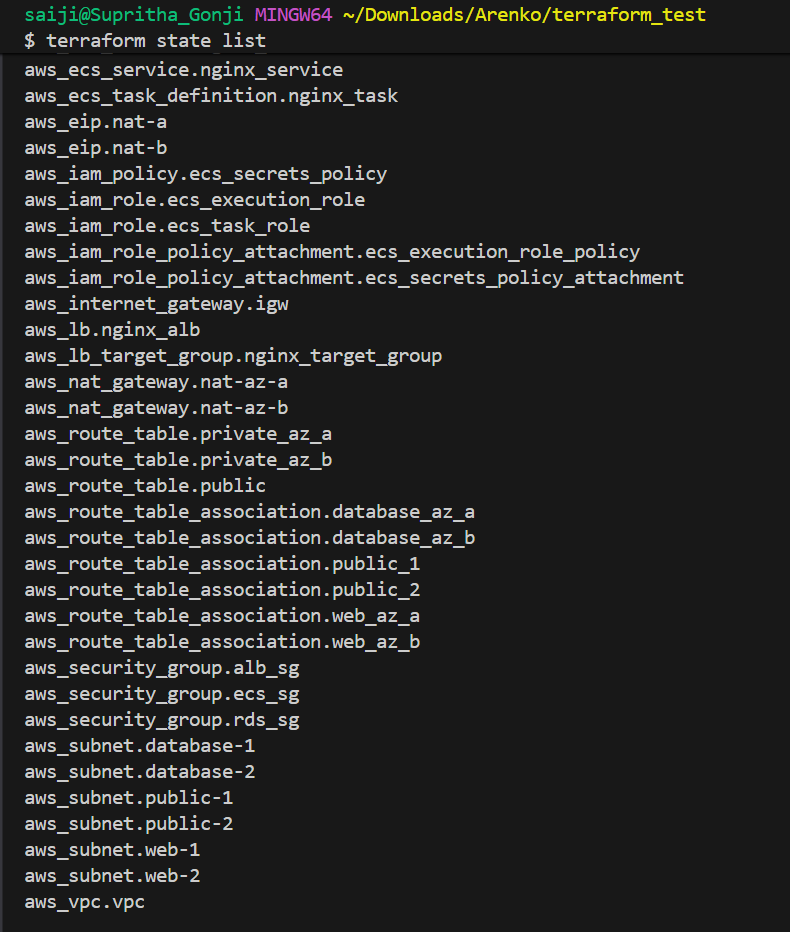
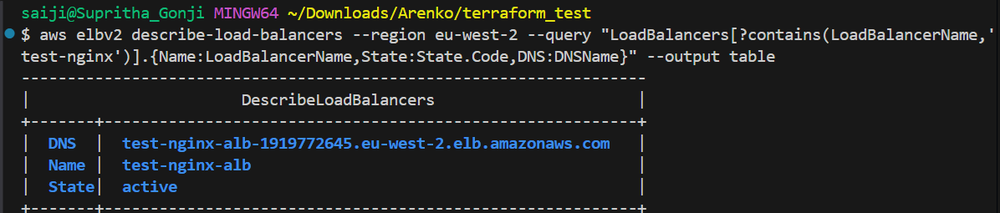
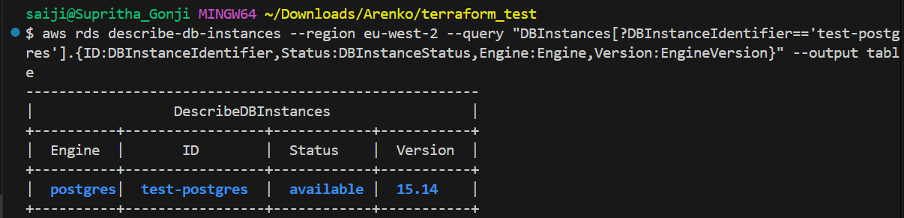
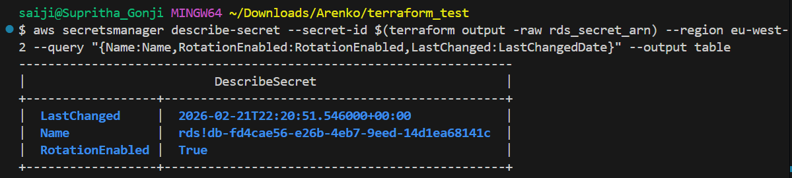

# Technical exercise 

Here you have some terraform which does not work! 

Please fix it and look at making changes for production best practices and reusability.

Feel free to add useful additional functionality where you feel it's appropriate to extend or improve the solution.

Please ensure you fully understand the changes you make, we will be diving deeper in a follow-up 
technical session and please list out any questions or assumptions you make.

Please send back your submission as a git repository or github link. 

# Solution applied 

# Terraform - Nginx on ECS Fargate

Provisions a nginx service on ECS Fargate behind an Application Load Balancer, with a private RDS PostgreSQL instance and supporting network infrastructure.

## Architecture

- VPC with public, private web, and private database subnet tiers across two AZs
- ALB in public subnets, ECS Fargate tasks in private web subnets, RDS in private database subnets
- One NAT gateway per AZ for outbound traffic from private subnets
- RDS credentials managed via Secrets Manager with automatic rotation, managed natively by RDS
- HTTPS support behind a feature flag, disabled by default

## Prerequisites

- Terraform >= 1.10.0
- AWS CLI configured with appropriate credentials
- S3 bucket created for remote state: `arenko-tf-state` in `eu-west-2`
- S3 bucket must have versioning and SSE-KMS encryption enabled

## Usage

```bash
terraform init
terraform fmt
terraform validate
terraform plan
terraform apply
```

## Enabling HTTPS

Set `enable_https = true` and provide a `domain_name` in your tfvars. The ACM certificate
uses DNS validation. You will need to create the validation CNAME records in Route53 before
the certificate reaches an issued state and the HTTPS listener becomes active.

## Remote State

State is stored in S3 with native file locking via `use_lockfile = true`, available since
Terraform 1.10. No DynamoDB table is required.

## RDS Security

- RDS master password is managed natively by RDS via `manage_master_user_password = true`.
  The password is never passed through Terraform and is never stored in tfstate.
  Automatic rotation is enabled by default. Retrieve credentials at runtime using the
  ARN from the `rds_secret_arn` output.
- RDS has deletion protection enabled. A `terraform destroy` will require manually disabling
  it first via the AWS console or by setting `deletion_protection = false` before destroy.

## Succesfully deployed the ECS Fargate and complete Infrastructure 

### terraform apply - 38 resources, 0 errors



### terraform output



### terraform state list - all 38 resources



### ALB - active, eu-west-2



### RDS - test-postgres, available, postgres 15.14



### Secrets Manager - rotation enabled, managed by RDS



## References

S3 Backend - https://developer.hashicorp.com/terraform/language/backend/s3

RDS Instance - https://registry.terraform.io/providers/hashicorp/aws/latest/docs/resources/db_instance

ECS Service - https://registry.terraform.io/providers/hashicorp/aws/latest/docs/resources/ecs_service

ALB - https://registry.terraform.io/providers/hashicorp/aws/latest/docs/resources/lb

ALB Target Group - https://registry.terraform.io/providers/hashicorp/aws/latest/docs/resources/lb_target_group

ACM Certificate - https://registry.terraform.io/providers/hashicorp/aws/latest/docs/resources/acm_certificate